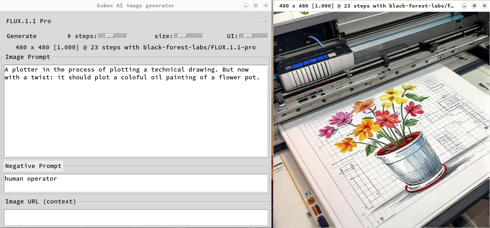

# kubux-ai-image-generator

A desktop application for generating AI images using Together.ai's image generation models. Create high-quality, custom images directly from text prompts with precise control over dimensions and generation parameters.



## Features

- **Text-to-Image Generation**: Turn your text descriptions into images
- **Simple Aspect Ratio Management**: Select the aspect ratio by resizing the view window
- **Full-Screen Image Viewer**: View generated images with zoom, pan, and fullscreen capabilities
- **Prompt History**: Save and reuse successful prompts
- **Native Look and Feel**: Automatically detects and uses your system's UI font settings
- **Adjustable Parameters**:
  - Control the number of generation steps for quality vs. speed
  - Adjust image size/resolution scale
  - Customize UI scaling to suit your display
  - Choose from a variety of AI models from Together.ai
- **Organized Storage**: Images generated from the same data are saved in the same directory
- **Settings**: The app configuratoin is persitent between runs of the program

## Installation

### Setup the API key

- You need an API key from Together.ai. You can get one at [together.ai](https://together.ai))
- Create a `.env` file in your home directory with your API key:
   ```
   TOGETHER_API_KEY=your_api_key_here
   ```

### Using Nix (Recommended)

The easiest way to install is using the Nix package manager:

```bash
# Install directly from GitHub
nix profile install github:k-u-bux/kubux-image-manager
```

### Manual Installation (Untested)

**Warning**: Manual installation is untested and may require additional configuration.

#### Prerequisites

- Python 3.8 or higher
- tkinter
- PIL/Pillow
- python-dotenv
- requests
- together 1.5.21 or compatible version

#### Setup

1. Clone this repository:
   ```bash
   git clone https://github.com/k-u-bux/kubux-image-manager.git
   cd kubux-image-manager
   ```

2. Install dependencies:
   ```bash
   pip install pillow requests python-dotenv together==1.5.21
   ```

## Usage

### Running the Application

Nix will put the program in your path:
```bash
kubux-ai-image-generator
```

For manual install, you will have to run the python interpreter:
```bash
python kubux-ai-image-generator.py
```

### Generating Images

1. Enter a detailed text prompt in the input area
2. Optionally add a negative prompt to specify what you don't want in the image
3. Optionally provide a context image URL for image-to-image generation
4. Adjust generation settings as needed:
   - **Steps**: Higher values (20-48) for more detailed images, lower values (12-20) for faster generation
   - **Size**: Adjust the scale to control resolution (higher values create larger, more detailed images)
   - **Aspect**: You adjust the aspect ratio by resizing the image window
5. Select the model you want to use from the dropdown menu
6. Click "Generate" to create your image
7. View, zoom and explore your generated image in the viewer

### Image Viewer Controls

- **Mouse Wheel**: Zoom in/out
- **Left-Click + Drag**: Pan image when zoomed in
- **F11**: Toggle fullscreen mode
- **Keyboard +/=**: Zoom in
- **Keyboard -/_**: Zoom out
- **Keyboard 0**: Reset zoom to fit window

## Supported Models

The application supports several models from [Together.ai](https://www.together.ai) and [Black Forest Labs](https://blackforestlabs.ai/), including:

- FLUX.1 Pro
- FLUX.1.1 Pro
- FLUX.1 Schnell (including Free tier)
- FLUX.1 Dev (with LoRA support)
- FLUX.1 Canny (edge-based conditioning)
- FLUX.1 Depth (depth-based conditioning)
- FLUX.1 Redux (image variation and restyling)
- FLUX.1 Kontext Dev (text and image input)

## Configuration

The application stores its configuration in:
- `~/.config/kubux-ai-image-generator/app_settings.json` - Application settings
- `~/.config/kubux-ai-image-generator/prompt_history.json` - Saved prompts
- `~/.config/kubux-ai-image-generator/neg_prompt_history.json` - Saved negative prompts
- `~/.config/kubux-ai-image-generator/context_history.json` - Saved context image URLs
You do not need to edit these files. Current settings are saved automatically.

Generated images are saved by default to:
- `~/Pictures/kubux-ai-image-generator/`
This can be changed through the navigation bar at the bottom.


## Troubleshooting

### API Key Issues
If you see "API Error" messages, check that your Together.ai API key is valid and correctly set in the `.env` file.

### Missing UI Elements
If UI elements appear too small or too large, use the UI scale slider in the top-right to adjust the interface size.

## About the Project

This application was developed to provide a simple, desktop-native interface for AI image generation without requiring technical knowledge of APIs or command-line tools. It focuses on making the image generation process as straightforward as possible while providing the necessary controls for high-quality results.

## License

This project is licensed under the Apache License 2.0 - see the LICENSE file for details.

## Acknowledgments

- Built with the [Together.ai API](https://www.together.ai/blog/flux-1-kontext) for image generation
- Uses models from [Black Forest Labs](https://blackforestlabs.ai/)
